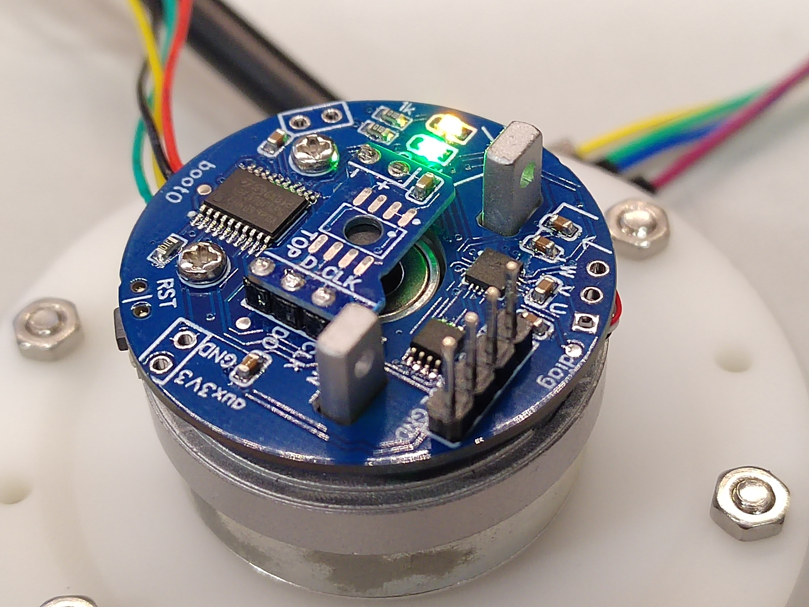

### 用于3205电机的FOC控制模块

此代码仓库是运行在下面硬件上的一个简单的FOC控制demo

硬件：https://oshwhub.com/xdedss/motor3205_driver_board

### ST-Link连接

板背面下方的4pin接口为stlink连接用，从背面看，从左到右依次为 GND SWDIO SWDCLK 3v3

### 电角度零点调整

根据安装角度的微弱差异，需要调整磁编码器角度到电角度的转换关系式。在 main.c 中40行左右：

``` c
#define ELEC_ANGLE_ZERO_POINT 0.565
```

这一数值可能会因安装角度不同而需要修正。如何知道修正值？方法是让电机自己转到0电角度，然后读取此时磁编码器的值。下面是具体操作方法

首先确认磁编码器装在哪一面。磁编码器的小pcb板正反面均可以安装，可以根据需要自行决定。如果装在TOP面上，需要把代码里的`MAG_MOUNTED_ON_TOP`取消注释，如果在BTM面则不用改动

```c
//#define MAG_MOUNTED_ON_TOP
```

之后将44行的`TEST_ELEC_ANGLE_ZERO_POINT`这个flag取消注释，就会进入调试零点的模式

``` c
//#define TEST_ELEC_ANGLE_ZERO_POINT
```

用STM32CUBEIDE进入调试，不要给电机施加任何外力，待电机角度稳定后（此时用手转电机应该会感到一股力量使其回到特定的角度）查看全局变量mag_r的值，用这个值替换掉`ELEC_ANGLE_ZERO_POINT`的值即可

### I2C指令

电机驱动板作为I2C的slave，接受主机发来的指令。指令固定为5bytes长度，第一个byte为flag，指示指令类型，之后的4个byte为float数值（Little-endian）

flag定义位于main.c

```c
#define I2C_UPDATE_FLAG_FORCE_TARGET 1
#define I2C_UPDATE_FLAG_VELOCITY_TARGET 2
#define I2C_UPDATE_FLAG_POSITION_TARGET 3
#define I2C_UPDATE_FLAG_VELOCITY_KP 4
#define I2C_UPDATE_FLAG_VELOCITY_KI 5
#define I2C_UPDATE_FLAG_POSITION_KP 6
#define I2C_UPDATE_FLAG_POSITION_KI 7
#define I2C_UPDATE_FLAG_POSITION_KD 8
```

这些值对应着设定PIDState中的相应数值，例如想要控制电机转到固定角度，就让主机发送1byte的`I2C_UPDATE_FLAG_POSITION_TARGET`+4bytes的转角浮点数（单位为rad）

i2c从机地址默认为7，注意如果要一个主机控制多个电机的话避免冲突，可以打开ioc文件自行调整并生成代码

如果手上没有其他设备可以作为主机测试I2C功能，那么可以用一块电机驱动板当主机，另一块当从机。主机烧录代码时取消注释`TEST_SENDING_I2C`，然后将两个板的i2c引脚相连即可。F070的I2C引脚已经设置了内置上拉所以不用再外接上拉电阻




